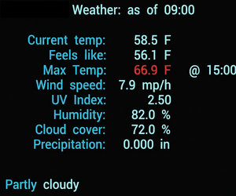
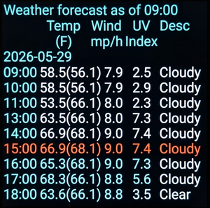
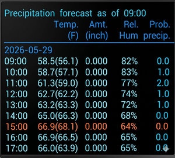
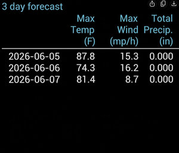

# Openmeteo Weather on the pimoroni Presto

## Description

This micropython application polls https://api.open-meteo.com to get the forecast for a given latitude and longitude. Through control files the user can specify their wifi SSID and password, the frequency of polling, the longitude and latitude, units (metric/imperial) and the number of lines of data to display.

There are four screens of displayable data, accessible by swiping left and right:

* Current weather. Includes: temperature, UV index, wind speed, precipitation data.

* Hourly list of forecast data: Temperature, wind speed, UV Index and a brief description of the weather (clear, cloudy, foggy, rain, ...).
  

* Hourly list of precipitation forecast: Temperature, total precipitation amount, relative humidity and probability of precipitation.

* Three day forecast of maximum daily temperature, maximum daily windspeed and total precipitation.

## Modules

### main.py

The driver of the application. After initialization; main.py permanently iterates, polling openmeteo according to the user specified frequency of polling. Note that this is coded as a stand-alone application and will replace the sample application that comes with the pimoroni Presto. You can use the Thonny IDE to download the pimoroni code if you wish to save it. Or you can move it to a new directory on the RP2350.

### control.py

Allows the developer to control the polling time (from 1 to 15 minutes), the number of hours to display in the forecasts, the start and end hours and whether or not the application is in testing mode.

### router_base.py

Copy this to router.py and edit the copied file to change the WiFi SSID and password need to be modified to connect to a router. The OPEN_STREETMAP_AGENT needs to be modified to allow a lookup of the city name associated with the latitude and longitude.

### openmeteo_api_data.py

Specify the longitude, latitude, timezone and units (metric/imperial).

### openmeteo.py

Issues the openmeteo API forecast query and formats the display.

### display_functions.py

Handles the Presto screen vector IO.

### Colors.py

A dictionary of RGB colors.

## Customization

Three control files need to be modified:

### control.py

* QUERY_INTERVAL_MINUTES = 15

    main.py polls the openmeteo API server once every QUERY_INTERVAL. The validation code in control.py ensures that this is an integer value. If the TESTING value is False, then QUERY_INTERVAL has a minimum value of 15. If the TESTING value is True, then QUERY_INTERVAL has a minimum value of 1.
    Note: there is a limit of 1000 polls a day in the free API. openmeteo data is only updated once every 15 minutes in *hourly* mode.

* TESTING = True

    When set to False, all debugging print statements in the program are replaced with a print function that does nothing. TESTING can also be used by the developer to add additional debugging code as required. Should be set to False for the final run-time, but there is no harm in leaving this True as the lack of a terminal for output does not impact the program.

* FORECAST_HOURS = 9

    Affects how many lines of forecast data are printed in the hourly forecast and precipitation forecast screens. Note: 9 should be the outside limit for the default font-size.

* START_HOUR = 4

    Hours from midnight until this time will display nothing, unless the screen is touched.

* END_HOUR = 22

    Hours from START_HOUR to this hour are active hours. During inactive hours, the screen is dimmed and no polling is done

START_HOUR and END_HOUR are on a 24 hour clock.

### openmeteo_api_data.py

* LONGITUDE, LATITUDE

    The longitude and latitude to be used for the weather query.

* TIMEZONE = "auto"

    Openmeteo will determine the timezone (used to adjust local time based upon
    GMT. It is possible to hard-code these, such as TIMEZONE="America/New_York" or TIMEZONE="Europe/Berlin".

* UNITS = "imperial"  # imperial / metric

    Use "imperial" for Fahrenheit/mph/inches. Use "metric" for Celsius/mps/mm.

### router_base.py

Copy this file to router.py and edit accordingly. **Note**: for security it is best to install mpy-cross (pip install mpy-cross) and create a .mpy file. Upload the .mpy file to keep the SSID and password from being editable if the Presto is compromised. **mpy-cross -O2 router.py**

WIFI_SSID = "Your router's SSID"
WIFI_PASSWORD = "Your router's password"
OPEN_STREETMAP_AGENT = "APPNAME/VERSION (your_email_address or website_url)"

**Q:** Does the user agent have to contain identifying information, such as the e-mail address?

**A:** According to Nominatim's strict official Usage Policy, yes, it should ideally contain a way to contact you.

While the server won't programmatically read your string and parse whether it's a real email address, their policy explicitly states that the User-Agent must be set to a "valid contact description." Here is why they want this, how to handle it safely, and an alternative if you don't want to expose your personal details:

**Why do they require it?**

Nominatim is a free, community-funded service run on donated hardware. If your script accidentally goes haywire (e.g., gets stuck in an infinite loop and bombards their servers with thousands of requests), system administrators look at the logs. If there is an email: They will often email you to ask you to fix the bug. If it's anonymous or generic: They will simply block your entire IP address or IP range from accessing the service completely.

**The Standard Format**

AppName/Version (YourEmailAddress or WebsiteURL)

## Notes

The following modules need to be uploaded to the RP2350:

* Colors.py
* control.py
* display_functions.py
* main.py
* network_access.py
* openmeteo.py
* openmeteo_api_data.py
* router.py
  
The modules have been tested with Roboto-Medium font, which is installed on the Presto. The degree symbol (°) is not in this font. However the Roboto-Medium-With-Material-Symbols.af font, which is available from pimoroni, *does* have this symbol. But when I used it, the lower-case "t" did not print properly.

main.py invokes the openstreemap interface from Nominatim to look up the city name associated with the latitude and longitude. The call is done once in the initialization() function of the module. See the notes in router_base.py concerning this API.

Only four colors are used. You can modify the colors to suit your tastes. To save space, back up Colors.py and create a new dictionary with only the colors you need.

### Interface notes

The initial screen is the current weather based upon the last poll of the server. Swipe left on the screen to see the hourly precipitation forecast. Swipe right from the current weather to see the hourly temperature/wind speed/UVI index forecast. Swipe left or right two times from the current weather screen to see the three day forecast.

The screens are cyclic. Swiping left or right four times in a row will return the the screen at the start of a cycle (meaning: if you are on the precipitation screen and swipe right 4 times, you will return to the precipitation screen).

Swiping down dims the display by 5%. Swiping up increases the brightness by 5%. Initial brightness is 50%.

Outside of the start and end times, the screen is cleared and dimmed to 0% brightness. No server polling is done. However, if the screen is tapped, the server is polled and the screen remains active for the duration of the current wait state. Thus if polling is 15 minutes and the wait is at minute 10 of the current wait cycle; tapping the screen will turn on the display at the last brightness level, a weather poll will be issued and displayed for the remaining 5 minutes.
